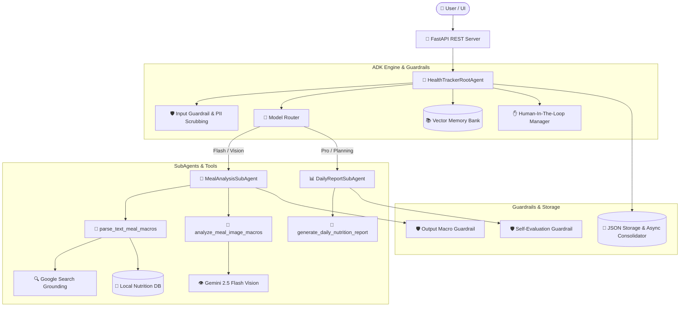

# 🥗 Health Tracker Agent - Enterprise Python ADK

A production-grade, multi-agent health tracking system built using the custom Python **Agent Development Kit (ADK)** and powered by **Google Gemini 2.5** (`flash-lite`, `flash`, `pro`).

The system orchestrates multi-modal meal logging (text and visual photo parsing), live nutrition lookups via **Google Search Grounding**, long-term memory retrieval, automated daily health report planning, and strict security and evaluation guardrails.

---

## 🌟 Key Features

- **Multi-Agent Architecture**: Modular multi-agent orchestration (`RootAgent`, `MealAnalysisSubAgent`, `DailyReportSubAgent`) utilizing Coordinator and Sequential design patterns.
- **Multimodal Visual Meal Engine**: Direct image content parsing powered by **Gemini 2.5 Flash Vision** and **PIL** feature analysis.
- **Dynamic Google Search Grounding**: Real-time web search fallback grounding for unrecognized or custom food items.
- **Persistent Vector Memory Bank**: Vector embeddings and context compaction for long-term user session history.
- **Non-blocking Async Memory Consolidation**: Non-blocking background worker threads for context processing.
- **LLM Tiering & Model Router**: Intelligent routing of tasks across model tiers:
  - `gemini-2.5-flash-lite`: Fast text parsing
  - `gemini-2.5-flash`: Vision & macro search grounding
  - `gemini-2.5-pro`: Complex daily report planning & self-evaluation
- **Production Guardrails & Safety**:
  - **Input Guardrail**: Prompt injection & PII filtering
  - **Output Guardrail**: Macro boundary verification (0-3000 kcal, 0-250g protein)
  - **Self-Eval Guardrail**: Automated quality assessment of generated reports
  - **Human-in-the-Loop Intercept**: Pending token authorization before high-stakes actions (e.g. deleting user history)
- **Enterprise Observability & Security**:
  - **Structured JSON Logging**: Explicit `PRE_EXECUTION` and `POST_EXECUTION` metadata
  - **OpenTelemetry Tracing**: Contextual span and trace propagation (`trace_id`, `span_id`)
  - **Active PII Scrubbing**: Redacts email addresses, phone numbers, SSNs, and credit cards before logging/storage
  - **SecretManager Injection**: Zero hardcoded credentials; secure runtime secret injection
- **Evaluation & IaC**:
  - **Golden Dataset Regression Harness**: 5-benchmark static test suite measuring macronutrient accuracy (overall MAPE threshold ≤ 5%)
  - **Terraform IaC**: Infrastructure as Code configurations for Cloud Run, Secret Manager, and Artifact Registry

---

## 🏗 System Architecture



---

## 🛠 Project Structure

```
health-tracker-agent/
├── adk/                        # Agent Development Kit Framework
│   ├── base.py                 # Base Agent & SubAgent abstractions
│   ├── constitution.py         # System Prompt & Constitution guidelines
│   ├── context.py              # Context Compaction & Token Budgeting
│   ├── guardrails.py           # Input, Output & Self-Eval Guardrails
│   ├── human_in_the_loop.py    # High-stakes action confirmation manager
│   ├── logging.py              # Structured JSON Logger & Active PII Redactor
│   ├── patterns.py             # Coordinator & Sequential Design Patterns
│   ├── router.py               # Dynamic Model Router (Flash-Lite / Flash / Pro)
│   ├── schemas.py              # Pydantic Tool & Agent Schemas
│   ├── tools.py                # ADK Tool Wrapper & Decorator
│   └── tracing.py              # OpenTelemetry Tracing System
├── agents/                     # Specialized Agents
│   ├── root_agent.py           # HealthTrackerRootAgent orchestrator
│   ├── meal_analysis_agent.py  # MealAnalysisSubAgent
│   └── daily_report_agent.py   # DailyReportSubAgent
├── models/                     # Core Domain Pydantic Schemas
│   └── schemas.py              # UserProfile, MealLog, FoodItem, DailyReport
├── services/                   # Application Services
│   ├── nutrition_db.py         # Nutrition lookup, parsing & Search Grounding
│   ├── secrets.py              # GCP Secret Manager & fallback service
│   ├── storage.py              # JSON disk persistence service
│   ├── vector_memory.py        # Persistent Vector Memory Bank
│   └── async_memory.py         # Background worker memory consolidator
├── static/                     # Web Dashboard UI Assets
│   ├── index.html              # Single Page Application HTML
│   ├── style.css               # Glassmorphism & Vanilla CSS styles
│   └── app.js                  # Frontend REST API interaction logic
├── terraform/                  # Infrastructure as Code (IaC)
│   ├── main.tf                 # Terraform Cloud Run, Secret Manager & Registry
│   ├── variables.tf            # Terraform variables
│   └── outputs.tf              # Terraform deployment outputs
├── tests/                      # Testing & Evaluation Harness
│   ├── test_adk_core.py        # Core ADK unit tests
│   ├── test_agents.py          # SubAgent unit tests
│   ├── test_guardrails.py      # Guardrail security tests
│   ├── test_storage.py         # Persistence & storage unit tests
│   └── eval_harness.py         # Golden dataset static regression evaluation
├── app.py                      # FastAPI Web Application Server
├── cli.py                      # Developer CLI Harness
├── requirements.txt            # Python Dependencies
└── README.md                   # Project Documentation
```

---

## 🚀 Quickstart Guide

### 1. Prerequisites
- Python 3.9+ installed
- Google Cloud Project with Gemini API enabled (or local `GEMINI_API_KEY`)

### 2. Installation

Clone the repository and install dependencies:
```bash
cd health-tracker-agent
python3 -m venv venv
source venv/bin/activate
pip install -r requirements.txt
```

### 3. Environment Configuration

Set your Gemini API key:
```bash
export GEMINI_API_KEY="your-gemini-api-key-here"
```
*(If unset, SecretManager gracefully falls back to mock development mode).*

---

## 💻 Running the Application

### Option A: Web Server & Interactive UI Dashboard

Start the FastAPI application:
```bash
python3 -m uvicorn app:app --host 127.0.0.1 --port 8000
```
Open your browser and navigate to **[http://127.0.0.1:8000](http://127.0.0.1:8000)**.

### Option B: Developer CLI Interface

```bash
# Log a natural language text meal
python3 cli.py log-text "2 eggs and 2 slices sourdough toast" --meal-type breakfast

# Log a photo meal
python3 cli.py log-image static/samples/salmon_quinoa_bowl.png --meal-type lunch

# Generate a Daily Health & Fitness Report
python3 cli.py report

# Display current User Profile & Target Goals
python3 cli.py profile
```

---

## 🧪 Testing & Evaluation Harness

### Run Automated Unit Tests (22 Tests)
```bash
python3 -m unittest discover -s tests -p "test_*.py"
```

### Run Static Regression Benchmark Harness
Evaluates system accuracy against the 5-item Golden Dataset benchmark:
```bash
python3 cli.py eval
```
**Expected Output**:
```json
{
  "total_test_cases": 5,
  "passed_cases": 5,
  "failed_cases": 0,
  "overall_mape_pct": 0.86,
  "passed_threshold": true
}
```

---

## ☁️ Infrastructure as Code (IaC) Deployment

To provision Google Cloud infrastructure via **Terraform**:

```bash
cd terraform
terraform init
terraform plan -out=tfplan
terraform apply tfplan
```

This provisions:
- **Secret Manager**: Secure API key storage
- **Artifact Registry**: Docker container repository
- **Cloud Run**: Managed serverless container deployment

---

## 🔒 Security & Privacy

- **Active PII Redaction**: Automatically scrubs emails, phone numbers, and credentials before logging or writing to disk.
- **Human-in-the-Loop Confirmation**: Restricts high-stakes destructive operations (e.g. history wipe) behind one-time confirmation tokens.
- **Input & Output Guardrails**: Enforces prompt safety and validates macro bounds.
